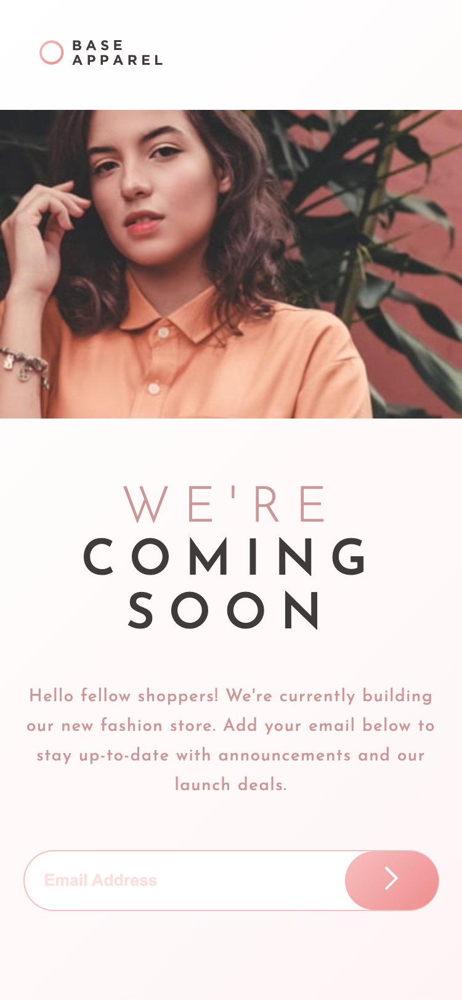

# Frontend Mentor - Base Apparel coming soon page solution

This is a solution to the [Base Apparel coming soon page challenge on Frontend Mentor](https://www.frontendmentor.io/challenges/base-apparel-coming-soon-page-5d46b47f8db8a7063f9331a0). Frontend Mentor challenges help you improve your coding skills by building realistic projects. 

## Table of contents
  - [The challenge](#the-challenge)
  - [Screenshot](#screenshot)
  - [Links](#links)
  - [Built with](#built-with)
  - [What I learned](#what-i-learned)
  - [Continued development](#continued-development)
  - [Author](#author)

### The challenge

Users should be able to:

- View the optimal layout for the site depending on their device's screen size
- See hover states for all interactive elements on the page
- Receive an error message when the `form` is submitted if:
  - The `input` field is empty
  - The email address is not formatted correctly

### Screenshot

 

### Links

- Solution URL: [Github](https://github.com/kaecodes/base-apparel-coming-soon.git)
- Live Site URL: [Add live site URL here](https://your-live-site-url.com)

### Built with

- Semantic HTML5 markup
- CSS custom properties
- Flexbox
- CSS Grid
- Mobile-first workflow

### What I learned

I re-learned form validation using JavaScript. I've also put CSS Flexbox and CSS Grid into practice. 

### Continued development

I want to continue to focus on improving my CSS skills, specifically CSS Flexbox and CSS grid. I also want to strengthen my JavaScript knowledge. 

## Author

- Website - [LinkedIn](https://linkedin.com/in/kdtnguyen)
- Frontend Mentor - [@kaecodes](https://www.frontendmentor.io/profile/kaecodes)
